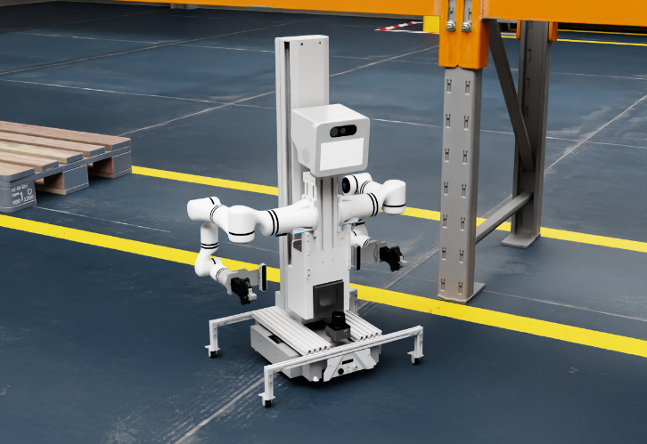
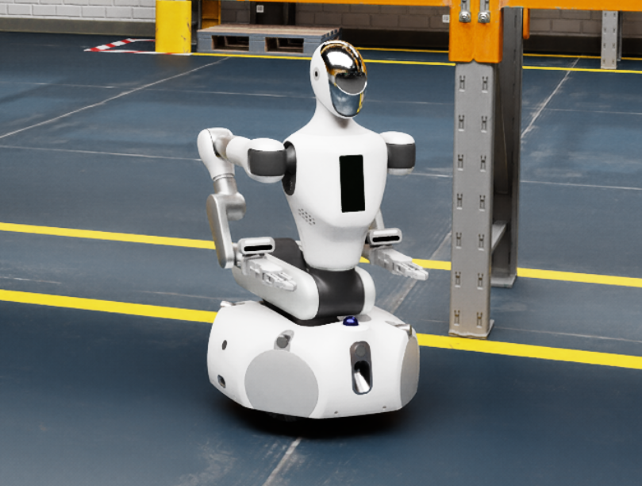
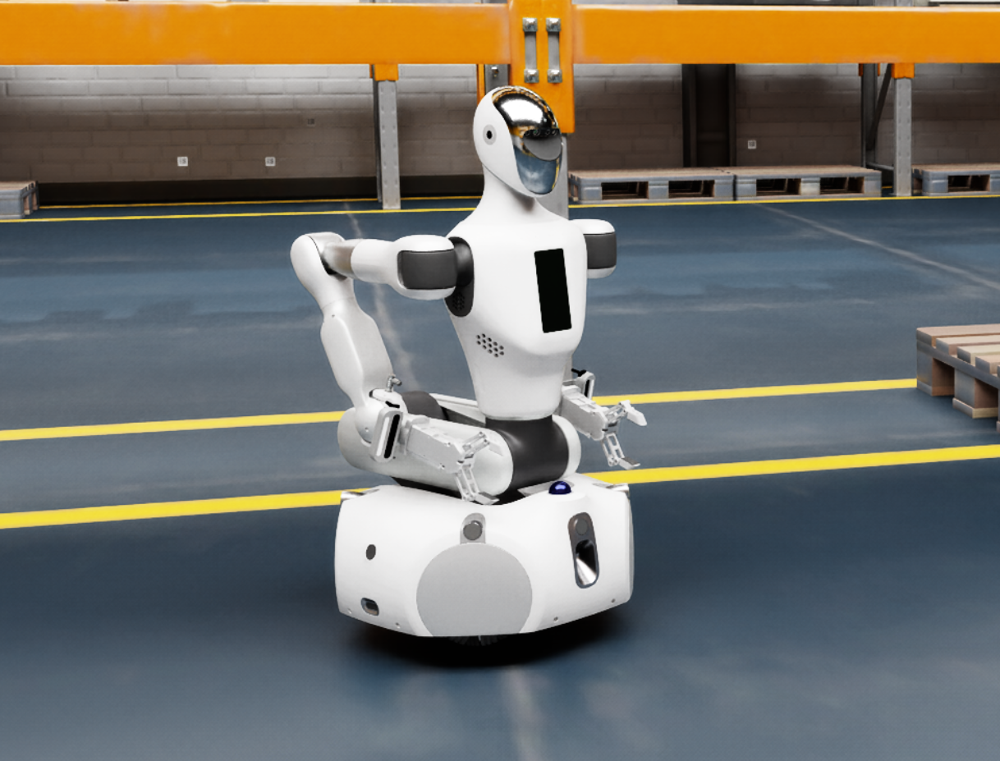
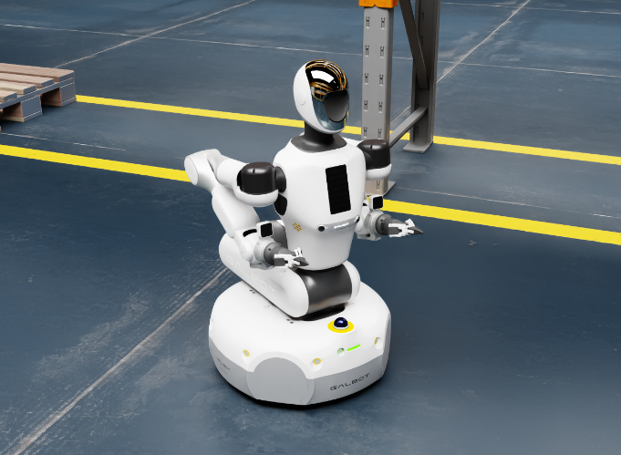
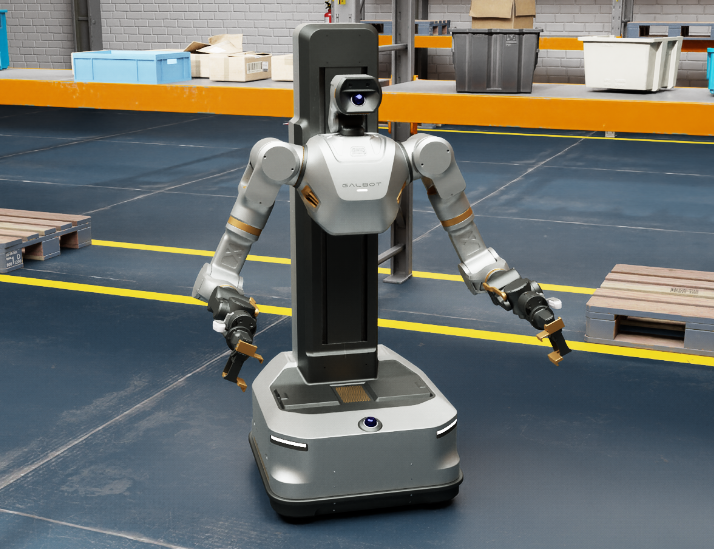

# Galbot Robots

Galbot humanoid robot USD assets.

## Gallery

<div align="center">

|                                                                     | | |
|:-------------------------------------------------------------------:|:---:|:---:|
|    |  |  |
|          **Galbot Zero**<br>`Galbot_Zero/Galbot_Zero.usda`          | **Galbot One**<br>`Galbot_One/Galbot_One.usda` | **Galbot One Charlie**<br>`Galbot_One` arms variant |
|  |  |  |
|           **Galbot Foxtrot**<br>`Galbot_G1` head variant            | **Galbot Golf**<br>`Galbot_G1` head variant | **Galbot S1**<br>`Galbot_S1/Galbot_S1.usda` |

</div>

## Setup

```bash
cd FaSim-Isaac/robots/
git submodule init humanoid/Galbot/
git submodule update humanoid/Galbot/
```

## Models

- **Galbot Zero**: `Galbot_Zero/Galbot_Zero.usda`
- **Galbot One**: `Galbot_One/Galbot_One.usda`
- **Galbot One Charlie**: `Galbot_One` with `Galbot_Charlie_Arms`
- **Galbot Foxtrot**: `Galbot_G1` with `Head_Foxtrot`
- **Galbot Golf**: `Galbot_G1` with `Head_Golf`
- **Galbot S1**: `Galbot_S1/Galbot_S1.usda`
